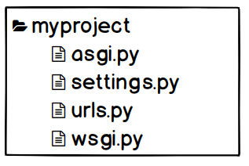
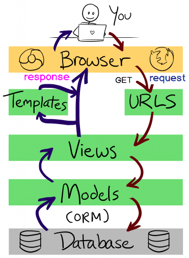
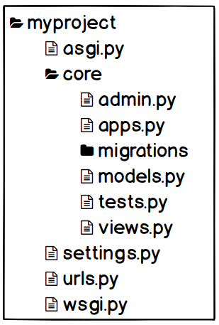
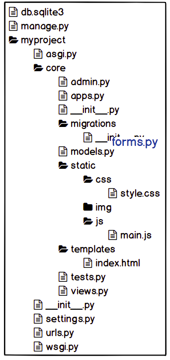
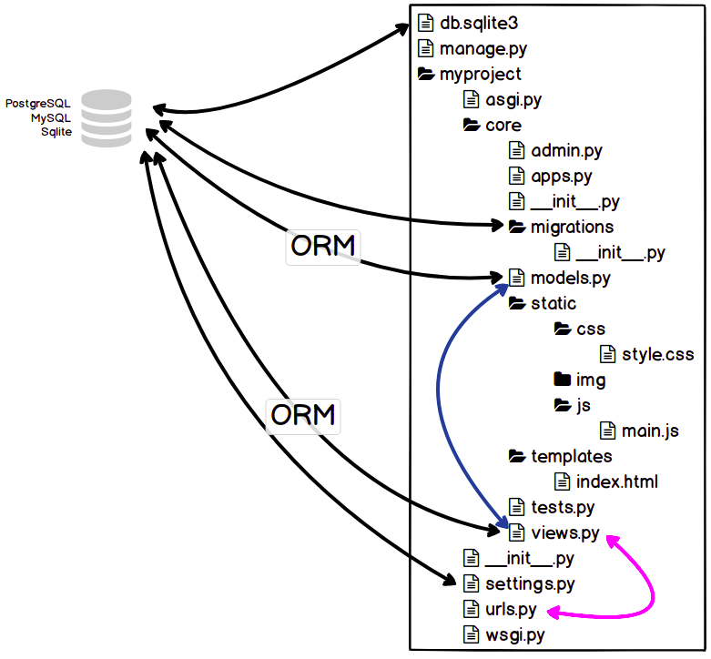
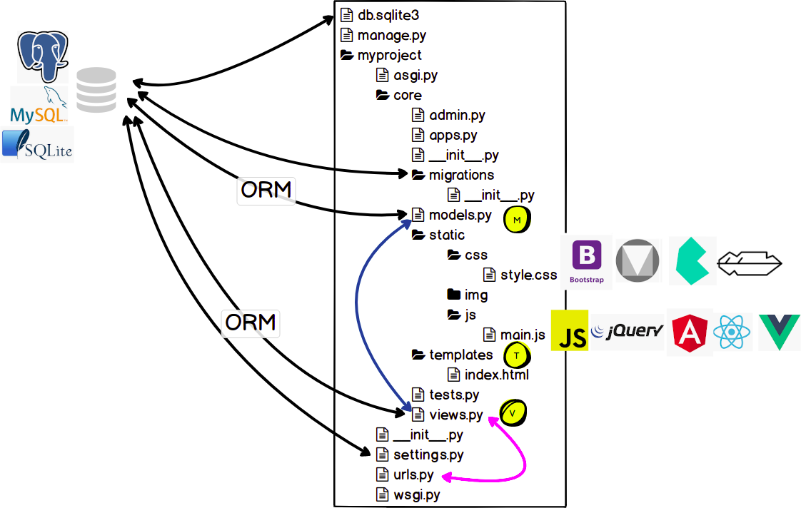

# Introdução a Arquitetura do Django

## Instalando o Django

```
python3 -m venv .venv
source .venv/bin/activate
pip install -U pip
pip install django
```

### Criando o projeto

```
django-admin startproject myproject .
python manage.py runserver
```



## Render sem app

## request e response



## GET

Verbo HTTP onde os parâmetros são passados no cabeçalho da requisição.

Ex: `example.com/?search=python`

Máximo 255 caracteres.

## POST

Envia os parâmetros no corpo da requisição.

Geralmente os valores são passados através de um formulário.

Ex: Arquivo só é enviado via POST.


### Exemplo

```
#urls.py
from django.http import HttpResponse


def index(request):
    return HttpResponse('<h1 style="font-family: sans-serif">Pyjamas Conf 2019</h1>')

urlpatterns = [
    path('', index),
    ...
]
```


## Criando app core

```
cd myproject
python ../manage.py startapp core
```




```
#core/views.py

def index(request):
    return HttpResponse('<h1 style="font-family: sans-serif">Pyjamas Conf 2019</h1>')
```

```
#urls.py
from myproject.core.views import index

urlpatterns = [
    path('', index),
    ...
]
```

### Usando um template simples

```
mkdir core/templates
touch core/templates/index.html

#index.html
<!DOCTYPE html>
<html lang="en">
<head>
  <meta charset="UTF-8">
  <meta name="viewport" content="width=device-width, initial-scale=1.0">
  <title>Pyjamas 2019 - Django</title>

  <style>
    h1 {
      font-family: sans-serif
    }
  </style>
</head>
<body>
  <h1>Pyjamas Conf 2019</h1>
</body>
</html>
```

```
#settings.py
INSTALLED_APPS = [
    ...
    'myproject.core',
]
```

```
#views.py
from django.shortcuts import render


def index(request):
    return render(request, 'index.html')
```

```
#urls.py
from myproject.core.views import index


urlpatterns = [
    path('', index),
    ...
]
```




## MTV


```
python manage.py migrate
python manage.py createsuperuser
```


## Estáticos

```
cd ..
mkdir -p myproject/core/static/{css,js,img}
touch myproject/core/static/css/style.css
touch myproject/core/static/js/main.js
```







## Admin

## ORM

```
python manage.py shell
from django.contrib.auth.models import User

users = User.objects.all()
users.count()
users.first()
```

## FBV - Function Based Views

https://www.youtube.com/watch?v=2qZcPb8ZWQA

## Forms

## CBV - Class Based Views

https://www.youtube.com/watch?v=2qZcPb8ZWQA

## Herança de templates

https://www.youtube.com/watch?v=YuKdwIhJysU

## Herança de models


## Links

http://pythonclub.com.br
https://simpleisbetterthancomplex.com
https://www.djangoproject.com
https://docs.djangoproject.com/en/3.0/releases/3.0

